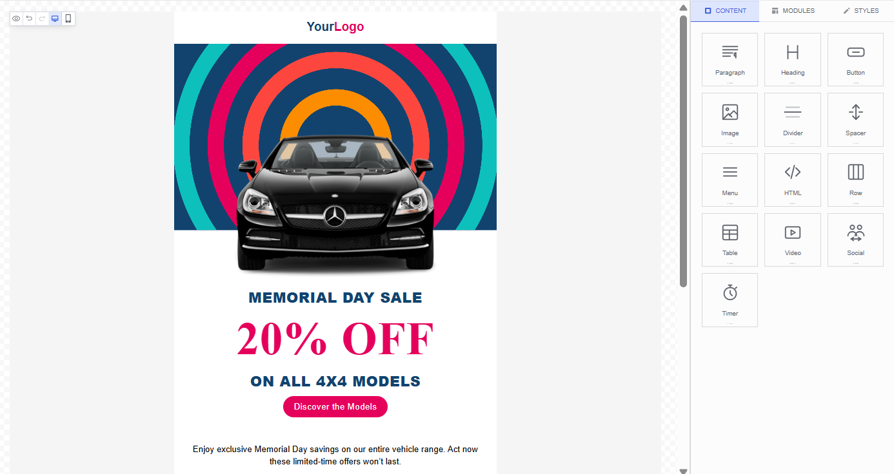

<p align="center">
  <a href="https://dragble.com">
    
  </a>
</p>

<p align="center">
  <a href="https://www.npmjs.com/package/dragble-vue-editor"></a>
  <a href="https://github.com/Dragble/dragble-vue-editor/blob/main/LICENSE"></a>
</p>

# dragble-vue-editor

AI-powered Vue 3 component for building **email templates** with drag-and-drop. Embed a full-featured **AI-powered email editor** into your Vue app — create responsive HTML emails, newsletters, transactional email templates, and email marketing campaigns visually without writing code.

[Dragble](https://dragble.com) is a modern **AI-powered email builder** and **email template editor** that lets your users design professional emails with a visual drag-and-drop interface.

[Website](https://dragble.com) | [Documentation](https://docs.dragble.com) | [Dashboard](https://developers.dragble.com)

<p align="center">
  
</p>

## Features

- Drag-and-drop **email template builder** with 20+ content blocks
- Responsive **HTML email** output compatible with all major email clients
- **Newsletter editor** with merge tags, dynamic content, and display conditions
- Visual **email designer** — no HTML/CSS knowledge required for end users
- Export to HTML, JSON, image, PDF, or ZIP
- Built-in image editor, AI content generation, and collaboration tools
- Full TypeScript support
- Vue 3 Composition API support with component and composable

## Installation

The SDK is loaded from CDN automatically — you only need to install the Vue wrapper.

```bash
npm install dragble-vue-editor
```

```bash
yarn add dragble-vue-editor
```

```bash
pnpm add dragble-vue-editor
```

## Editor Key

An `editorKey` is required to use the editor. You can get one by creating a project on the [Dragble Developer Dashboard](https://developers.dragble.com).

## Quick Start

```vue
<template>
  <DragbleEditor
    ref="editorRef"
    editor-key="your-editor-key"
    editor-mode="email"
    :height="800"
    @ready="onReady"
    @change="onChange"
  />
</template>

<script setup lang="ts">
import { ref } from "vue";
import { DragbleEditor } from "dragble-vue-editor";

const editorRef = ref<InstanceType<typeof DragbleEditor>>();

const onReady = () => {
  console.log("Editor ready!");
};

const onChange = async (data: { design: unknown; type: string }) => {
  // Design JSON is available directly from the callback
  const json = data.design;
  console.log("Design JSON:", json);

  // To get HTML, call exportHtml on the editor ref
  const html = await editorRef.value?.exportHtml();
  console.log("HTML:", html);
};
</script>
```

## Props

| Prop                | Type                                     | Default      | Description                       |
| ------------------- | ---------------------------------------- | ------------ | --------------------------------- |
| `editorKey`         | `String`                                 | **required** | Editor key for authentication     |
| `design`            | `DesignJson \| ModuleData \| null`       | `undefined`  | Initial design to load            |
| `editorMode`        | `EditorMode`                             | `"email"`    | `"email"` \| `"web"` \| `"popup"` |
| `popup`             | `PopupConfig`                            | `undefined`  | Popup configuration               |
| `contentType`       | `"module"`                               | `undefined`  | Single-row module editor          |
| `ai`                | `AIConfig`                               | `undefined`  | AI features configuration         |
| `locale`            | `String`                                 | `undefined`  | UI locale                         |
| `translations`      | `Record<string, Record<string, string>>` | `undefined`  | Translation overrides             |
| `textDirection`     | `TextDirection`                          | `undefined`  | `"ltr"` or `"rtl"`                |
| `language`          | `Language`                               | `undefined`  | Template language                 |
| `appearance`        | `AppearanceConfig`                       | `undefined`  | Visual customization              |
| `tools`             | `ToolsConfig`                            | `undefined`  | Tool enable/disable               |
| `customTools`       | `DragbleToolConfig[]`                   | `undefined`  | Custom tools                      |
| `features`          | `FeaturesConfig`                         | `undefined`  | Feature toggles                   |
| `fonts`             | `FontsConfig`                            | `undefined`  | Fonts configuration               |
| `bodyValues`        | `Record<string, unknown>`                | `undefined`  | Body values                       |
| `header`            | `unknown`                                | `undefined`  | Locked header row                 |
| `footer`            | `unknown`                                | `undefined`  | Locked footer row                 |
| `mergeTags`         | `(MergeTag \| MergeTagGroup)[]`          | `undefined`  | Merge tags                        |
| `specialLinks`      | `(SpecialLink \| SpecialLinkGroup)[]`    | `undefined`  | Special links                     |
| `modules`           | `Module[]`                               | `undefined`  | Custom modules                    |
| `displayConditions` | `DisplayConditionsConfig`                | `undefined`  | Display conditions                |
| `editor`            | `EditorBehaviorConfig`                   | `undefined`  | Editor behavior                   |
| `customCSS`         | `string[]`                               | `undefined`  | Custom CSS URLs                   |
| `customJS`          | `string[]`                               | `undefined`  | Custom JS URLs                    |
| `height`            | `String \| Number`                       | `"600px"`    | Editor height                     |
| `minHeight`         | `String \| Number`                       | `"600px"`    | Minimum height                    |
| `options`           | `EditorOptions`                          | `undefined`  | Additional options                |
| `callbacks`         | `Omit<DragbleCallbacks, ...>`           | `undefined`  | SDK callbacks                     |

| `collaboration`     | `boolean \| CollaborationFeaturesConfig` | `undefined`  | Collaboration features            |
| `user`              | `UserInfo`                               | `undefined`  | User info                         |
| `designMode`        | `"edit" \| "live"`                       | `undefined`  | Template permissions              |

## Events

| Event     | Description                     |
| --------- | ------------------------------- |
| `ready`   | Editor is initialized and ready |
| `load`    | Design has been loaded          |
| `change`  | Design has changed              |
| `error`   | An error occurred               |
| `comment` | Comment event                   |

## Exposed Methods

All SDK methods are accessible via a template ref. Key methods:

| Method                             | Returns                | Description                              |
| ---------------------------------- | ---------------------- | ---------------------------------------- |
| `loadDesign(design, options?)`     | `void`                 | Load a design                            |
| `loadBlank(options?)`              | `void`                 | Load a blank design                      |
| `getDesign()`                      | `Promise`              | Get current design JSON                  |
| `exportHtml(options?)`             | `Promise<string>`      | Export as HTML                           |
| `exportJson()`                     | `Promise<DesignJson>`  | Export design JSON                       |
| `exportPlainText()`                | `Promise<string>`      | Export as plain text                     |
| `exportImage(options?)`            | `Promise`              | Export as image                          |
| `exportPdf(options?)`              | `Promise`              | Export as PDF                            |
| `exportZip(options?)`              | `Promise`              | Export as ZIP                            |
| `setMergeTags(config)`             | `void`                 | Set merge tags config                    |
| `getMergeTags()`                   | `Promise`              | Get merge tags                           |
| `setSpecialLinks(config)`          | `void`                 | Set special links                        |
| `setModules(modules)`              | `void`                 | Set custom modules                       |
| `setFonts(config)`                 | `void`                 | Set fonts config                         |
| `setBodyValues(values)`            | `void`                 | Set body values                          |
| `setToolsConfig(config)`           | `void`                 | Set tools config                         |
| `setAppearance(config)`            | `void`                 | Set appearance                           |
| `setEditorMode(mode)`              | `void`                 | Set editor mode                          |
| `setLocale(locale, translations?)` | `void`                 | Set locale                               |
| `setTextDirection(direction)`      | `void`                 | Set text direction                       |
| `setLanguage(language)`            | `void`                 | Set language                             |
| `setDisplayConditions(config)`     | `void`                 | Set display conditions                   |
| `setOptions(options)`              | `void`                 | Set additional options                   |
| `showPreview(device?)`             | `void`                 | Show design preview                      |
| `hidePreview()`                    | `void`                 | Hide preview                             |
| `undo()`                           | `void`                 | Undo last action                         |
| `redo()`                           | `void`                 | Redo last action                         |
| `canUndo()`                        | `Promise<boolean>`     | Check if undo available                  |
| `canRedo()`                        | `Promise<boolean>`     | Check if redo available                  |
| `save()`                           | `void`                 | Trigger save                             |
| `audit(options?)`                  | `Promise<AuditResult>` | Run design audit                         |
| `registerTool(config)`             | `Promise`              | Register a custom tool                   |
| `unregisterTool(id)`               | `Promise`              | Unregister a tool                        |
| `addEventListener(event, cb)`      | `() => void`           | Subscribe to event (returns unsubscribe) |
| `removeEventListener(event, cb)`   | `void`                 | Unsubscribe from event                   |

## Composable

For more control over the editor lifecycle, use the `useDragbleEditor` composable:

```vue
<script setup lang="ts">
import { useDragbleEditor } from "dragble-vue-editor";

const { editor, isReady, containerId } = useDragbleEditor({
  editorKey: "your-editor-key",
  editorMode: "email",
});

const exportHtml = async () => {
  if (editor.value) {
    const html = await editor.value.exportHtml();
    console.log(html);
  }
};
</script>

<template>
  <div :id="containerId" style="height: 600px" />
  <button @click="exportHtml" :disabled="!isReady">Export</button>
</template>
```

**Returns:**

| Property      | Type                       | Description                          |
| ------------- | -------------------------- | ------------------------------------ |
| `editor`      | `Ref<DragbleSDK \| null>` | SDK instance (null until ready)      |
| `isReady`     | `Ref<boolean>`             | Whether the editor is initialized    |
| `containerId` | `string`                   | DOM element ID to bind the editor to |

## TypeScript

Full type definitions are included. Import types directly from the package:

```ts
import type {
  DesignJson,
  EditorMode,
  AppearanceConfig,
} from "dragble-vue-editor";
```

## Contributing

See [CONTRIBUTING.md](./CONTRIBUTING.md) for guidelines on how to contribute to this project.

## License

[MIT](./LICENSE)

