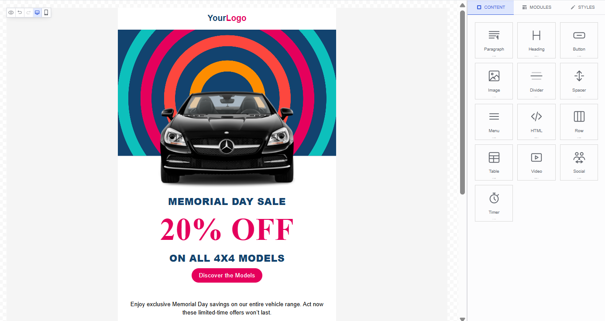

<p align="center">
  <a href="https://dragble.com">
    
  </a>
</p>

<p align="center">
  <a href="https://www.npmjs.com/package/dragble-vue-editor"></a>
  <a href="https://github.com/Dragble/dragble-vue-editor/blob/main/LICENSE"></a>
</p>

# dragble-vue-editor

The **fully AI-powered** Vue 3 editor for **email templates** and **landing pages**. Your end-users design visually with drag-and-drop — or describe what they want and watch AI agents build it live on the canvas. Powered by the built-in **Model Context Protocol (MCP)** server, connect [Claude Code](https://claude.com/code), [OpenCode](https://opencode.ai), [Codex](https://github.com/openai/codex), [Cursor](https://cursor.com), or your own AI backend directly to the editor. Structured tool calls mean guaranteed-valid output — no prompt engineering, no JSON hallucination, no broken layouts.

[Dragble](https://dragble.com) brings two design experiences together in one Vue component: a polished visual editor for designers and a conversational AI surface for everyone else — backed by structured tool calls that produce guaranteed-valid HTML emails and landing pages every time.

[Website](https://dragble.com) | [Documentation](https://docs.dragble.com) | [Dashboard](https://developers.dragble.com)

<p align="center">
  
</p>

## Features

- Drag-and-drop **email template builder** with 20+ content blocks
- **Fully AI-powered via MCP** — connect AI agents (Claude Code, OpenCode, Codex, Cursor) or your own AI backend to build designs live on the canvas. Structured tool calls mean guaranteed-valid output — no prompt engineering, no JSON hallucination
- Responsive **HTML email** output compatible with all major email clients
- **Newsletter editor** with merge tags, dynamic content, and display conditions
- Visual **email designer** — no HTML/CSS knowledge required for end users
- Export to HTML, JSON, image, PDF, or ZIP
- Built-in image editor, AI content generation, and collaboration tools
- Full TypeScript support
- Vue 3 Composition API support with component and composable

## Installation

The SDK is loaded from CDN automatically — you only need to install the Vue wrapper.

```bash
npm install dragble-vue-editor
```

```bash
yarn add dragble-vue-editor
```

```bash
pnpm add dragble-vue-editor
```

## Editor Key

An `editorKey` is required to use the editor. You can get one by creating a project on the [Dragble Developer Dashboard](https://developers.dragble.com).

## Quick Start

```vue
<template>
  <DragbleEditor
    ref="editorRef"
    editor-key="your-editor-key"
    editor-mode="email"
    :height="800"
    @ready="onReady"
    @change="onChange"
  />
</template>

<script setup lang="ts">
import { ref } from "vue";
import { DragbleEditor } from "dragble-vue-editor";

const editorRef = ref<InstanceType<typeof DragbleEditor>>();

const onReady = () => {
  console.log("Editor ready!");
};

const onChange = async (data: { design: unknown; type: string }) => {
  // Design JSON is available directly from the callback
  const json = data.design;
  console.log("Design JSON:", json);

  // To get HTML, call exportHtml on the editor ref
  const html = await editorRef.value?.exportHtml();
  console.log("HTML:", html);
};
</script>
```

## Complete Example

```vue
<template>
  <div class="advanced-email-builder">
    <div class="toolbar">
      <button type="button" @click="editorRef?.undo()">Undo</button>
      <button type="button" @click="editorRef?.redo()">Redo</button>
      <button type="button" @click="editorRef?.showPreview('desktop')">
        Preview
      </button>
      <button type="button" @click="handleExportHtml">Export HTML</button>
      <button type="button" @click="handleExportImage">Export Image</button>
      <span v-if="isDirty" class="dirty-indicator">Unsaved changes</span>
    </div>

    <DragbleEditor
      ref="editorRef"
      editor-key="your-editor-key"
      editor-mode="email"
      height="100%"
      design-mode="live"
      :options="editorOptions"
      @ready="handleReady"
      @change="handleChange"
      @error="handleError"
    />
  </div>
</template>

<script setup lang="ts">
import { ref } from "vue";
import {
  DragbleEditor,
  type DesignJson,
  type DragbleSDK,
  type EditorOptions,
} from "dragble-vue-editor";

const editorRef = ref<InstanceType<typeof DragbleEditor> | null>(null);
const isDirty = ref(false);

const editorOptions: EditorOptions = {
  appearance: { theme: "light" },
  features: {
    preview: true,
    undoRedo: true,
    imageEditor: true,
  },
};

const handleReady = (editor: DragbleSDK) => {
  // Set merge tags (must pass a MergeTagsConfig object)
  editor.setMergeTags({
    customMergeTags: [
      { name: "First Name", value: "{{first_name}}" },
      { name: "Last Name", value: "{{last_name}}" },
      { name: "Company", value: "{{company}}" },
    ],
    excludeDefaults: false,
    sort: true,
  });

  // Set custom fonts
  editor.setFonts({
    showDefaultFonts: true,
    customFonts: [{ label: "Brand Font", value: "BrandFont, sans-serif" }],
  });

  // Load saved design if available
  const savedDesign = localStorage.getItem("email-design");
  if (savedDesign) {
    editor.loadDesign(JSON.parse(savedDesign));
  }
};

const handleChange = (data: { design: DesignJson; type: string }) => {
  isDirty.value = true;
  localStorage.setItem("email-design", JSON.stringify(data.design));
};

const handleExportHtml = async () => {
  if (!editorRef.value) return;

  const html = await editorRef.value.exportHtml();
  const blob = new Blob([html], { type: "text/html" });
  const url = URL.createObjectURL(blob);
  const a = document.createElement("a");
  a.href = url;
  a.download = "email.html";
  a.click();
  URL.revokeObjectURL(url);
};

const handleExportImage = async () => {
  if (!editorRef.value) return;

  const data = await editorRef.value.exportImage();
  window.open(data.url, "_blank");
};

const handleError = (error: Error) => {
  console.error(error.message);
};
</script>

<style scoped>
.advanced-email-builder {
  height: 100vh;
  display: flex;
  flex-direction: column;
}

.toolbar {
  padding: 12px;
  border-bottom: 1px solid #ddd;
  display: flex;
  gap: 8px;
  align-items: center;
}

.dirty-indicator {
  color: orange;
}
</style>
```

## MCP — AI Integration

Connect AI agents (Claude Code, OpenCode, Codex, Cursor, or your own AI backend) to the editor through the [Model Context Protocol](https://modelcontextprotocol.io). Your backend uses `mcp_key`; third-party AI clients use `mcp_client_key` plus a pairing code. Tool calls mutate design state live on the canvas. No prompt engineering, no JSON hallucination, no broken output.

### Enabling MCP

MCP is on by default when your plan includes it. You can still set `features: { mcp: true }` explicitly, or set `features: { mcp: false }` to turn it off for an embed:

```vue
<DragbleEditor
  ref="editorRef"
  editor-key="db_pxl81cxn92wignwx"
/>
```

MCP also requires a **Starter plan or higher**. Both conditions must be true — plan allows it AND SDK has not opted out.

### Quick example — your backend controls the AI

```vue
<template>
  <button @click="handleConnectAI">Connect AI</button>
  <DragbleEditor
    ref="editorRef"
    editor-key="db_pxl81cxn92wignwx"
  />
</template>

<script setup lang="ts">
import { ref } from "vue";
import { DragbleEditor } from "dragble-vue-editor";

const editorRef = ref<InstanceType<typeof DragbleEditor> | null>(null);

const handleConnectAI = async () => {
  // The id is YOUR identifier — derive it from your own database/session
  // so the same user editing the same document always gets the same MCP
  // session. Example: if your logged-in user is "alice123" and they're
  // editing document "campaign-summer-2026", build an id like this:
  //
  //   const id = "alice123-campaign-summer-2026";
  //
  // Format rules: 8-128 chars, only letters/digits/hyphens/underscores.
  const userIdFromAuth = "alice123"; // from your auth/session
  const docIdFromRoute = "campaign-summer"; // from your URL or DB row
  const id = `${userIdFromAuth}-${docIdFromRoute}`;
  const { sessionId } = await editorRef.value!.editor!.joinMCP({ id });
  // Pass sessionId to your backend — it calls MCP tools with your backend mcp_key
};
</script>
```

### Quick example — end-user pairs their own AI client

```ts
const handleLetUserPair = async () => {
  const editor = editorRef.value!.editor!;
  // Same id you'd use anywhere else for this user+document combination.
  // 8-128 chars, only letters/digits/hyphens/underscores.
  const id = "alice123-campaign-summer-2026";
  const { code, expiresAt } = await editor.startMCPPairing({ id });
  alert(`Paste this into Claude Code: ${code}`);
};
```

### One controller per session

Each session can be controlled by **either** your backend **or** an end-user's AI client (Claude Code, OpenCode), never both at the same time:

- If your backend makes the first tool call → session is locked to **backend**. Pairing codes are rejected.
- If a user pairs via pairing code first → session is locked to **paired client**. Backend tool calls are rejected.

This prevents two AI controllers from conflicting on the same design.

### How it works

1. **Confirm MCP is enabled**: it is on by default; set `features: { mcp: false }` only when you want to opt out.
2. **Generate MCP keys** in the Dragble dashboard: use backend `mcp_key` for your server, and `mcp_client_key` for Claude/OpenCode/Cursor/Codex-style clients.
3. **Call `editor.joinMCP({ id })`** where `id` is a stable identifier you control (see below).
4. **Choose your AI path**: either your backend calls MCP tools directly (using `mcp_key`), or you generate a pairing code for the end-user to connect their own AI client (using `mcp_client_key`).
5. **Mutations stream live** onto the editor canvas as the AI works.

### The `id` parameter — why it matters

The `id` you pass to `joinMCP()` is a **Bring Your Own ID (BYOI)** that maps to your domain entities. It is NOT a random token — it is how Dragble identifies the session across browser refreshes, server restarts, and device switches.

**Rules:**

- 8–128 characters long
- Only letters, numbers, hyphens, and underscores (`a-z A-Z 0-9 - _`)
- Must be deterministic — the same user editing the same document should always produce the same `id`

**Why these rules?**

- The `id` is used in database lookups and URL paths — special characters or extreme lengths would break routing
- Same `id` = resume the same session. Random UUIDs mean every page refresh creates a new session and loses AI context
- Short IDs (< 8 chars) are too easy to guess, long IDs (> 128 chars) waste storage

```ts
// Recommended: derive from your domain — concrete examples
editor.joinMCP({ id: "alice123-campaign-summer-2026" }); // user + doc
editor.joinMCP({ id: "workspace_acme_template_welcome" }); // workspace + template
editor.joinMCP({ id: "org-uber-eats-promo-q4-2026" }); // org + campaign
editor.joinMCP({ id: "tenant_42_invoice_template_v3" }); // tenant + entity

// Valid but NOT recommended — random IDs break session continuity
// (every page refresh creates a brand new session, AI loses context)
editor.joinMCP({ id: crypto.randomUUID() });
```

### Disconnecting

`disconnectMCP()` permanently destroys the session — the session cannot be reopened:

```ts
const { destroyed } = await editor.disconnectMCP();
```

Your backend can also force-destroy a session server-side (e.g., when a user's subscription ends):

```bash
curl -X DELETE https://mcp.dragble.com/sessions/user-42-doc-99 \
  -H "X-API-Key: db_mcp_your_key_here"
```

Idle sessions are reaped after 2 hours of inactivity. Active sessions never expire — each tool call resets the timer.

### MCP method reference

| Method                                             | Returns                                                                 |
| -------------------------------------------------- | ----------------------------------------------------------------------- |
| `editor.joinMCP({ id, editorMode? })`              | `{ sessionId, resumed? }` for backend-managed flows                     |
| `editor.startMCPPairing({ id, editorMode? })`      | `{ sessionId, resumed?, code, expiresAt }` for client pairing           |
| `editor.disconnectMCP()`                           | `{ destroyed }` — permanently deletes session                           |
| `editor.getPairingCode()`                          | `{ code, expiresAt }` — generate a pairing code for end-user AI clients |
| `editor.endPairing()`                              | `{ revoked }` — invalidate the active pairing code                      |
| `editor.getMCPStatus()`                            | `{ paired: true, sessionId } \| { paired: false, reason? }`             |
| `editor.onAIToolFired(cb)`                         | unsubscribe fn — fires when AI calls any tool                           |

### Full documentation

- [MCP Overview](https://docs.dragble.com/mcp-server/overview)
- [Credentials & Security](https://docs.dragble.com/mcp-server/credentials)
- [AI Client Setup (OpenCode, Claude Code, Codex, etc.)](https://docs.dragble.com/mcp-server/ai-client-setup)

## Props

| Prop                | Type                                     | Default      | Description                       |
| ------------------- | ---------------------------------------- | ------------ | --------------------------------- |
| `editorKey`         | `String`                                 | **required** | Editor key for authentication     |
| `design`            | `DesignJson \| ModuleData \| null`       | `undefined`  | Initial design to load            |
| `editorMode`        | `EditorMode`                             | `"email"`    | `"email"` \| `"web"` \| `"popup"` |
| `popup`             | `PopupConfig`                            | `undefined`  | Popup configuration               |
| `contentType`       | `"module"`                               | `undefined`  | Single-row module editor          |
| `ai`                | `AIConfig`                               | `undefined`  | AI features configuration         |
| `locale`            | `String`                                 | `undefined`  | UI locale                         |
| `translations`      | `Record<string, Record<string, string>>` | `undefined`  | Translation overrides             |
| `textDirection`     | `TextDirection`                          | `undefined`  | `"ltr"` or `"rtl"`                |
| `language`          | `Language`                               | `undefined`  | Template language                 |
| `appearance`        | `AppearanceConfig`                       | `undefined`  | Visual customization              |
| `tools`             | `ToolsConfig`                            | `undefined`  | Tool enable/disable               |
| `customTools`       | `DragbleToolConfig[]`                    | `undefined`  | Custom tools                      |
| `features`          | `FeaturesConfig`                         | `undefined`  | Feature toggles                   |
| `fonts`             | `FontsConfig`                            | `undefined`  | Fonts configuration               |
| `bodyValues`        | `Record<string, unknown>`                | `undefined`  | Body values                       |
| `header`            | `unknown`                                | `undefined`  | Locked header row                 |
| `footer`            | `unknown`                                | `undefined`  | Locked footer row                 |
| `mergeTags`         | `(MergeTag \| MergeTagGroup)[]`          | `undefined`  | Merge tags                        |
| `specialLinks`      | `(SpecialLink \| SpecialLinkGroup)[]`    | `undefined`  | Special links                     |
| `modules`           | `Module[]`                               | `undefined`  | Custom modules                    |
| `displayConditions` | `DisplayConditionsConfig`                | `undefined`  | Display conditions                |
| `editor`            | `EditorBehaviorConfig`                   | `undefined`  | Editor behavior                   |
| `customCSS`         | `string[]`                               | `undefined`  | Custom CSS URLs                   |
| `customJS`          | `string[]`                               | `undefined`  | Custom JS URLs                    |
| `height`            | `String \| Number`                       | `"600px"`    | Editor height                     |
| `minHeight`         | `String \| Number`                       | `"600px"`    | Minimum height                    |
| `options`           | `EditorOptions`                          | `undefined`  | Additional options                |
| `callbacks`         | `Omit<DragbleCallbacks, ...>`            | `undefined`  | SDK callbacks                     |

| `collaboration` | `boolean \| CollaborationFeaturesConfig` | `undefined` | Collaboration features |
| `user` | `UserInfo` | `undefined` | User info |
| `designMode` | `"edit" \| "live"` | `undefined` | Template permissions |

## Composable

For more control over the editor lifecycle, use the `useDragbleEditor` composable:

```vue 3
<script setup lang="ts">
import { useDragbleEditor } from "dragble-vue-editor";

const { editor, isReady, containerId } = useDragbleEditor({
  editorKey: "your-editor-key",
  editorMode: "email",
});

const exportHtml = async () => {
  if (editor.value) {
    const html = await editor.value.exportHtml();
    console.log(html);
  }
};
</script>

<template>
  <div :id="containerId" style="height: 600px" />
  <button @click="exportHtml" :disabled="!isReady">Export</button>
</template>
```

**Returns:**

| Property      | Type                      | Description                          |
| ------------- | ------------------------- | ------------------------------------ |
| `editor`      | `Ref<DragbleSDK \| null>` | SDK instance (null until ready)      |
| `isReady`     | `Ref<boolean>`            | Whether the editor is initialized    |
| `containerId` | `string`                  | DOM element ID to bind the editor to |

## SDK Methods Reference

Access the SDK through the Vue component template ref (`editorRef.value`) or through the `editor` ref returned by `useDragbleEditor()`. The component exposes SDK methods directly, so calls such as `editorRef.value!.exportHtml()` work without reaching into framework internals. All export and getter methods return Promises.

```ts
const html = await editorRef.value!.exportHtml();
const design = await editor.value!.exportJson();
```

### Design

```ts
editorRef.value!.loadDesign(design, options?);                   // void
const result = await editorRef.value!.loadDesignAsync(design, options?);
// => { success, validRowsCount, invalidRowsCount, errors? }
editorRef.value!.loadBlank(options?);                            // void
const { html, json } = await editorRef.value!.getDesign();       // Promise
```

### Export

All export methods are **Promise-based**. There are no callback overloads.

```ts
const html = await editorRef.value!.exportHtml(options?);        // Promise<string>
const json = await editorRef.value!.exportJson();                // Promise<DesignJson>
const text = await editorRef.value!.exportPlainText();           // Promise<string>
const imageData = await editorRef.value!.exportImage(options?);  // Promise<ExportImageData>
const pdfData = await editorRef.value!.exportPdf(options?);      // Promise<ExportPdfData>
const zipData = await editorRef.value!.exportZip(options?);      // Promise<ExportZipData>
const values = await editorRef.value!.getPopupValues();          // Promise<PopupValues | null>
```

### Merge Tags

`setMergeTags` accepts a `MergeTagsConfig` object, not a plain array.

```ts
editorRef.value!.setMergeTags({
  customMergeTags: [
    { name: "First Name", value: "{{first_name}}" },
    { name: "Company", value: "{{company}}" },
  ],
  excludeDefaults: false,
  sort: true,
});
const tags = await editorRef.value!.getMergeTags(); // Promise<(MergeTag | MergeTagGroup)[]>
```

### Special Links

`setSpecialLinks` accepts a `SpecialLinksConfig` object.

```ts
editorRef.value!.setSpecialLinks({
  customSpecialLinks: [{ name: "Unsubscribe", href: "{{unsubscribe_url}}" }],
  excludeDefaults: false,
});
const links = await editorRef.value!.getSpecialLinks(); // Promise<(SpecialLink | SpecialLinkGroup)[]>
```

### Modules

```ts
editorRef.value!.setModules(modules); // void
editorRef.value!.setModulesLoading(loading); // void
const modules = await editorRef.value!.getModules(); // Promise<Module[]>
```

### Fonts

```ts
editorRef.value!.setFonts(config); // void
const fonts = await editorRef.value!.getFonts(); // Promise<FontsConfig>
```

### Body Values

```ts
editorRef.value!.setBodyValues({
  backgroundColor: "#f5f5f5",
  contentWidth: "600px",
});
const values = await editorRef.value!.getBodyValues(); // Promise<SetBodyValuesOptions>
```

### Editor Configuration

```ts
editorRef.value!.setOptions(options); // void — Partial<EditorOptions>
editorRef.value!.setToolsConfig(toolsConfig); // void
editorRef.value!.setEditorMode(mode); // void
editorRef.value!.setEditorConfig(config); // void
const config = await editorRef.value!.getEditorConfig(); // Promise<EditorBehaviorConfig>
```

### Locale, Language & Text Direction

```ts
editorRef.value!.setLocale(locale, translations?);            // void
editorRef.value!.setLanguage(language);                       // void
const lang = await editorRef.value!.getLanguage();            // Promise<Language | null>
editorRef.value!.setTextDirection(direction);                 // void — 'ltr' | 'rtl'
const dir = await editorRef.value!.getTextDirection();        // Promise<TextDirection>
```

### Appearance

```ts
editorRef.value!.setAppearance(appearance); // void
```

### Undo / Redo / Save

```ts
editorRef.value!.undo(); // void
editorRef.value!.redo(); // void
const canUndo = await editorRef.value!.canUndo(); // Promise<boolean>
const canRedo = await editorRef.value!.canRedo(); // Promise<boolean>
editorRef.value!.save(); // void
```

### Preview

```ts
editorRef.value!.showPreview(device?);  // void — 'desktop' | 'tablet' | 'mobile'
editorRef.value!.hidePreview();         // void
```

### Custom Tools

```ts
await editorRef.value!.registerTool(config); // Promise<void>
await editorRef.value!.unregisterTool(toolId); // Promise<void>
const tools = await editorRef.value!.getTools(); // Promise<Array<{ id, label, baseToolType }>>
```

### Custom Widgets

```ts
await editorRef.value!.createWidget(config); // Promise<void>
await editorRef.value!.removeWidget(widgetName); // Promise<void>
```

### Collaboration & Comments

```ts
editorRef.value!.showComment(commentId); // void
editorRef.value!.openCommentPanel(rowId); // void
```

### Tabs & Branding

```ts
editorRef.value!.updateTabs(tabs); // void
editorRef.value!.setBrandingColors(config); // void
editorRef.value!.registerColumns(cells); // void
```

### Display Conditions

```ts
editorRef.value!.setDisplayConditions(config); // void
```

### Audit

```ts
const result = await editorRef.value!.audit(options?);  // Promise<AuditResult>
```

### Asset Management

```ts
const { success, url, error } = await editorRef.value!.uploadImage(file, options?);
const { assets, total } = await editorRef.value!.listAssets(options?);
const { success, error } = await editorRef.value!.deleteAsset(assetId);
const folders = await editorRef.value!.listAssetFolders(parentId?);
const folder = await editorRef.value!.createAssetFolder(name, parentId?);
const info = await editorRef.value!.getStorageInfo();
```

### Status & Lifecycle

```ts
editorRef.value!.isReady(); // boolean
editorRef.value!.destroy(); // void
```

## Events

Component events (`@ready`, `@load`, `@change`, `@error`, `@comment`) cover the common Vue integration points. For lower-level SDK events, subscribe with `addEventListener` after the editor is ready:

```ts
const unsubscribe = editorRef.value?.addEventListener(
  "design:updated",
  (data) => {
    console.log("Design changed:", data);
  },
);

// Or remove manually
editorRef.value?.removeEventListener("design:updated", callback);
```

### Available Events

| Event                      | Description                 |
| -------------------------- | --------------------------- |
| `editor:ready`             | Editor initialized          |
| `design:loaded`            | Design loaded               |
| `design:updated`           | Design changed              |
| `design:saved`             | Design saved                |
| `row:selected`             | Row selected                |
| `row:unselected`           | Row unselected              |
| `column:selected`          | Column selected             |
| `column:unselected`        | Column unselected           |
| `content:selected`         | Content block selected      |
| `content:unselected`       | Content block unselected    |
| `content:modified`         | Content block modified      |
| `content:added`            | Content block added         |
| `content:deleted`          | Content block deleted       |
| `preview:shown`            | Preview opened              |
| `preview:hidden`           | Preview closed              |
| `image:uploaded`           | Image uploaded successfully |
| `image:error`              | Image upload error          |
| `export:html`              | HTML exported               |
| `export:plainText`         | Plain text exported         |
| `export:image`             | Image exported              |
| `save`                     | Save triggered              |
| `save:success`             | Save succeeded              |
| `save:error`               | Save failed                 |
| `template:requested`       | Template requested          |
| `element:selected`         | Element selected            |
| `element:deselected`       | Element deselected          |
| `export`                   | Export triggered            |
| `displayCondition:applied` | Display condition applied   |
| `displayCondition:removed` | Display condition removed   |
| `displayCondition:updated` | Display condition updated   |

## TypeScript

Full type definitions are included. Import types directly from the package:

```ts
import type {
  DesignJson,
  EditorMode,
  AppearanceConfig,
} from "dragble-vue-editor";
```

## Contributing

See [CONTRIBUTING.md](./CONTRIBUTING.md) for guidelines on how to contribute to this project.

## License

[MIT](./LICENSE)
